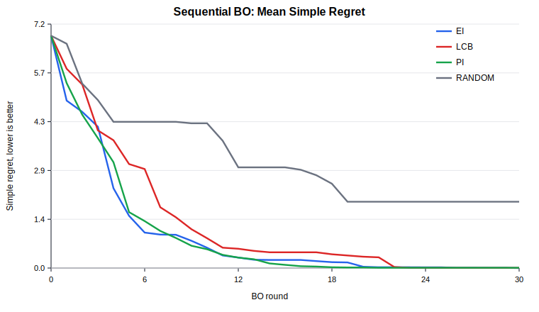
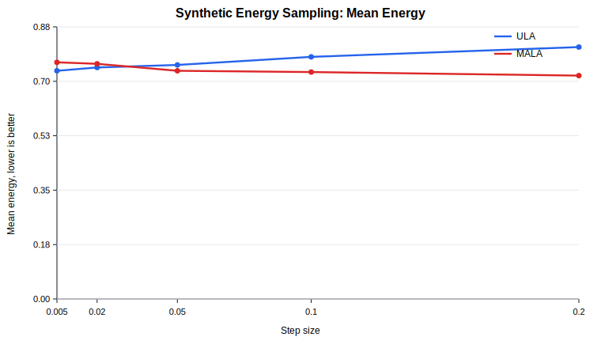

# Sampling and Bayesian Optimization Lab

This repository contains earlier coursework on energy-based sampling and
Bayesian optimization from IIT Bombay CS726.

It includes foundational implementations and experiments around Langevin
sampling, Gaussian Process regression, acquisition functions, and uncertainty
analysis.

## What This Project Demonstrates

- **Energy-based sampling:** ULA and MALA samplers for moving through an energy
  landscape using gradients and noise.
- **Gaussian Process regression:** exact GP posterior prediction with RBF,
  Matern, and Rational Quadratic kernels.
- **Bayesian optimization:** Expected Improvement, Probability of Improvement,
  Lower Confidence Bound, and random-search baselines on Branin-Hoo.
- **Uncertainty analysis:** RMSE tables and uncertainty-error correlation for GP
  predictions.
- **Testing and structure:** lightweight local demos, result CSVs, SVG plots,
  command-line runners, and unit tests.

## Why It Matters

Sampling and Bayesian optimization are useful building blocks for ML systems
where direct probability normalization or exhaustive evaluation is expensive.

Langevin methods show how gradients of an energy function can guide sampling.
Gaussian Processes show how a model can represent both predictions and
uncertainty. Acquisition functions then turn that uncertainty into a policy for
choosing what to evaluate next.

## Repository Map

| Path | Purpose |
| --- | --- |
| `energy_sampling/` | ULA/MALA sampling code, a reproducible 2D double-well demo, and an optional neural-energy reference path. |
| `bayesian_optimization/` | Branin-Hoo benchmark, kernels, GP posterior, acquisition functions, sequential BO runners, and original result CSVs. |
| `docs/results.md` | Clean summary of energy-sampling and Bayesian-optimization results. |
| `docs/technical_overview.md` | Detailed explanation of the sampling and GP/BO methods. |
| `docs/reproducibility.md` | Lightweight and optional neural-reference reproducibility instructions. |
| `docs/results/` | Checked-in CSV summaries from cleanup experiments. |
| `docs/assets/` | Curated plots and SVG summaries. |
| `tests/` | Unit tests for GP prediction, acquisition functions, sequential BO, and synthetic sampling. |

## Quick Local Demo

The fastest way to inspect the sampling side is the synthetic double-well demo.
It does not need PyTorch or external model artifacts.

```bash
python -m energy_sampling.synthetic_langevin_demo --no-plot
```

Run a short Bayesian optimization smoke test:

```bash
python -m bayesian_optimization.run_bo --n-initial 5 --n-rounds 2 --grid-size 12 --no-plot
```

## Local Verification

Install the lightweight dependencies:

```bash
python -m pip install -r requirements.txt
```

Run the unit tests:

```bash
python -m unittest discover
```

## Full Cleanup Experiments

Regenerate the multi-seed Bayesian optimization comparison:

```bash
python -m bayesian_optimization.compare_acquisitions --n-seeds 10 --n-rounds 30
```

Regenerate the synthetic energy step-size sweep:

```bash
python -m energy_sampling.compare_step_sizes --n-seeds 5
```

These commands write CSV summaries to `docs/results/` and SVG plots to
`docs/assets/`.

## Optional Neural-Energy Reference

The original high-dimensional neural-energy experiment used saved model weights
and tensor data that are not included in this repository.

Install optional neural dependencies:

```bash
python -m pip install -r requirements-neural.txt
```

Evaluate a saved neural energy regressor:

```bash
python -m energy_sampling.neural_energy_model --weights path/to/model.pth --dataset path/to/data.pt
```

Sample from the saved neural energy regressor:

```bash
python -m energy_sampling.neural_langevin_samplers --weights path/to/model.pth
```

## Reported Results

The original one-step GP comparison showed that sample size dominates GP
approximation quality:

| Initial Samples | Mean RMSE |
| ---: | ---: |
| 10 | 40.38 |
| 20 | 31.99 |
| 50 | 21.27 |
| 100 | 7.31 |

The later cleanup comparison runs EI, PI, LCB, and random search for 30 rounds
across 10 seeds:

| Acquisition | Final Simple Regret | AUC Simple Regret | Final RMSE |
| --- | ---: | ---: | ---: |
| EI | 0.000 | 27.71 | 25.15 |
| PI | 0.006 | 27.91 | 27.30 |
| LCB | 0.004 | 38.73 | 29.01 |
| Random | 1.949 | 96.44 | 13.18 |



The synthetic sampling sweep compares ULA and MALA across step sizes:



A fuller interpretation is available in `docs/results.md`.
