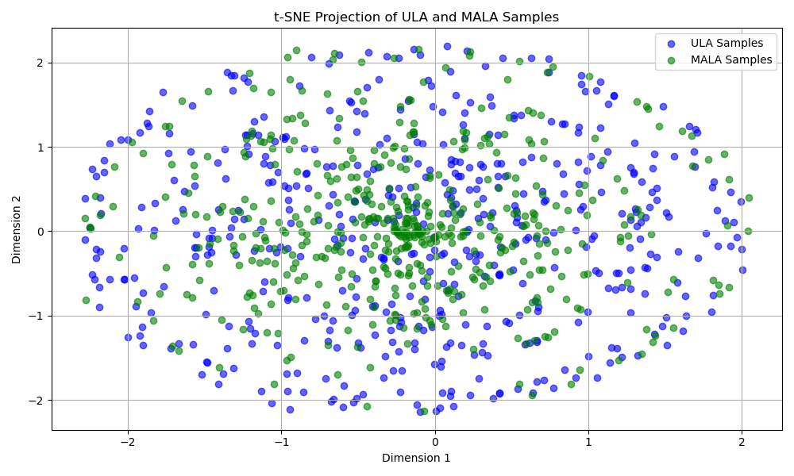

# Results Summary

The original course experiments covered energy-based sampling and Gaussian
Process Bayesian optimization. The tables below summarize the checked-in
results and the later cleanup experiments.

## Energy-Based Sampling

The original energy-sampling experiment used a learned neural energy model over
784-dimensional flattened image-like inputs. The repository also includes a
standalone 2D synthetic energy demo for lightweight reproduction.

| Sampler | Steps | Samples | Burn-in Time | Interpretation |
| --- | ---: | ---: | ---: | --- |
| ULA | 100 | 512 | 0.91s | Faster, broader spread, no correction step |
| MALA | 100 | 512 | 2.28s | Slower, more structured samples, MH correction |

## Synthetic Step-Size Sweep

The cleanup sweep compares ULA and MALA across five step sizes with five seeds
each. Lower mean energy is better; lower mode imbalance means samples are more
evenly split across the two wells.

| Sampler | Step Size | Mean Energy | Mode Imbalance | MALA Acceptance |
| --- | ---: | ---: | ---: | ---: |
| MALA | 0.005 | 0.766 | 0.013 | 0.9998 |
| ULA | 0.005 | 0.739 | 0.024 |  |
| MALA | 0.020 | 0.762 | 0.021 | 0.9984 |
| ULA | 0.020 | 0.750 | 0.025 |  |
| MALA | 0.050 | 0.739 | 0.022 | 0.9936 |
| ULA | 0.050 | 0.758 | 0.013 |  |
| MALA | 0.100 | 0.735 | 0.014 | 0.9822 |
| ULA | 0.100 | 0.784 | 0.018 |  |
| MALA | 0.200 | 0.723 | 0.015 | 0.9520 |
| ULA | 0.200 | 0.816 | 0.018 |  |

The sweep supports the expected tradeoff: MALA remains stable at larger step
sizes because it has an accept/reject correction, while ULA degrades more
quickly as the step size grows.

## Gaussian-Process Regression

The original GP experiment approximated the Branin-Hoo function over a dense
evaluation grid. Lower RMSE is better.

| Initial Samples | Mean RMSE |
| ---: | ---: |
| 10 | 40.38 |
| 20 | 31.99 |
| 50 | 21.27 |
| 100 | 7.31 |

The main trend is that sample size dominates GP approximation quality in this
setup.

## Original One-Step Acquisition Comparison

| Acquisition | Mean RMSE |
| --- | ---: |
| EI | 24.81 |
| Random | 25.40 |
| PI | 25.49 |

The one-step acquisition comparison is modest: EI is slightly better on average,
but the gap is small because each run adds only one acquisition-selected point
after the initial design.

## Multi-Seed Sequential BO Cleanup

The later cleanup comparison runs EI, PI, LCB, and random search for 30 rounds
across 10 seeds.

| Acquisition | Runs | Final Best Observed | Final Simple Regret | AUC Simple Regret | Final RMSE |
| --- | ---: | ---: | ---: | ---: | ---: |
| EI | 10 | 0.398 | 0.000 | 27.71 | 25.15 |
| PI | 10 | 0.405 | 0.006 | 27.91 | 27.30 |
| LCB | 10 | 0.402 | 0.004 | 38.73 | 29.01 |
| Random | 10 | 2.347 | 1.949 | 96.44 | 13.18 |

EI and PI reliably find the grid optimum or near-optimum, while random search
has much higher final regret and much worse cumulative regret. Random search has
lower final RMSE because it spreads samples broadly, which is useful for global
function approximation but not for optimization.

## Notes

- Original result CSVs are preserved in `bayesian_optimization/`.
- Cleanup result CSVs are preserved in `docs/results/`.
- The original one-step GP result CSVs and later cleanup summaries are both
  included for comparison.
